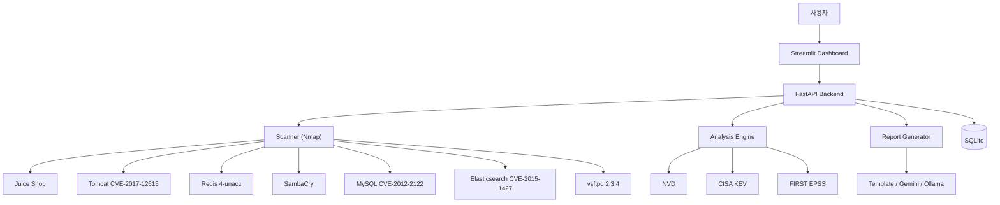

# Tribest ASM 프로젝트 스펙

## 1. 개요

Tribest ASM은 공격 표면 관점에서 자산을 스캔하고, 서비스 식별 결과를 기반으로 취약점 분석과 AI 브리핑까지 확인할 수 있게 만든 로컬 실습형 프로젝트다.

현재 기준으로 구현된 범위는 아래와 같다.
- FastAPI 백엔드
- Streamlit 대시보드
- Nmap 기반 스캐너
- rule-based 분석 모듈
- CVE / KEV / EPSS enrichment
- AI 브리핑 기반 report 저장 및 조회
- Docker Compose 기반 취약 컨테이너 실습 환경

중간 발표 기준으로는 완성형 ASM보다는, 자산 스캔부터 분석/브리핑/이력 조회까지 이어지는 축소형 ASM 프로토타입에 가깝다.

## 2. 현재 아키텍처



## 3. 디렉터리 구조

```text
analysis/
backend/
dashboard/
scanner/
targets/
Docs/
docker-compose.yml
README.md
```

- `analysis/`
  - 취약점 분석 및 enrichment
- `backend/`
  - API, 저장소, workflow 실행
- `dashboard/`
  - Streamlit UI
- `scanner/`
  - 스캔 프로필과 Nmap 호출
- `targets/`
  - 일부 취약 컨테이너 실행에 필요한 로컬 자산
- `Docs/`
  - 프로젝트 문서

## 4. 현재 실습 자산

현재 Compose 기준 자산은 아래와 같다.

### 기본 컨테이너
- `core-backend`
- `core-dashboard`
- `core-db`

### 취약 자산 컨테이너
- `vuln-juice-shop`
- `vuln-tomcat-cve-2017-12615`
- `vuln-redis-4-unacc`
- `vuln-sambacry`
- `vuln-mysql-cve-2012-2122`
- `vuln-elasticsearch-cve-2015-1427`
- `vuln-vsftpd-2-3-4`

### 대시보드 자산 표기
- `OWASP Juice Shop`
- `Apache Tomcat PUT JSP Upload (tomcat/CVE-2017-12615)`
- `Redis Unauthorized Access (redis/4-unacc)`
- `SambaCry (samba/CVE-2017-7494)`
- `MySQL Authentication Bypass (mysql/CVE-2012-2122)`
- `Elasticsearch Groovy Sandbox Escape (elasticsearch/CVE-2015-1427)`
- `vsftpd Backdoor (ftp/CVE-2011-2523)`

## 5. 스캔 프로필

현재 스캐너는 아래 프로필을 지원한다.

- `quick`
  - 핵심 포트 직접 지정 스캔
- `common`
  - Nmap 상위 100개 포트
- `deep`
  - Nmap 상위 1000개 포트
- `full`
  - 1-65535 전체 포트
- `web`
  - 웹 서비스 중심 포트 스캔

주의:
- `common`, `deep` 은 Nmap의 top-ports 의미를 그대로 따른다.
- 따라서 `deep` 이라고 해도 `6379` 같은 포트가 반드시 포함되는 것은 아니다.

## 6. 저장 구조

현재 SQLite에는 아래 결과물이 저장된다.
- `scan`
- `analysis`
- `report`

기준 단위는 `scan_id` 이다.

즉:
- 스캔 1회
- 분석 1회
- report 1회

가 하나의 `scan_id` 아래에 같이 저장된다.

이력 조회 시에는 현재 AI 엔진 설정과 무관하게, 저장된 report를 그대로 불러온다.

### Drift 기준
- 같은 `target.input_value` 의 직전 스캔과 비교
- 현재는
  - `new_ports`
  - `closed_ports`
  를 계산한다.

## 7. 분석 범위

현재 분석 모듈은 아래를 처리한다.

### Rule-based finding
- `Web Application Exposure`
- `Intentionally Vulnerable Web Application`
- `Apache Tomcat PUT JSP Upload Risk`
- `Redis Unauthorized Access`
- `Redis Replication Abuse RCE Risk`
- `SSH Service Exposure`
- `Samba Service Exposure`
- `SambaCry Remote Code Execution Risk`
- `FTP Plaintext Service Exposure`
- `vsftpd Backdoor Risk`
- `Database Service Exposure`
- `MySQL Authentication Bypass Risk`
- `Elasticsearch Unauthorized Access Risk`
- `Elasticsearch Groovy Sandbox Escape Risk`

### Enrichment
- NVD
- CISA KEV
- FIRST EPSS

현재는 중간 발표 안정성을 위해 오프라인 카탈로그 보강 결과를 우선 사용하고 있고, 이후 CPE 기반 NVD live lookup으로 확장할 예정이다.

## 8. 리포트

리포트는 아래를 포함한다.
- 스캔 ID
- 대상 정보
- 포트/서비스 요약
- 분석 결과 요약
- 조합 리스크
- drift
- AI 브리핑

AI 브리핑 엔진:
- `template`
- `gemini`
- `ollama`

이력 조회는 저장된 report를 그대로 사용하고, 재생성이 필요할 때만 별도 regenerate 흐름을 탄다.

## 9. 현재 한계

- 자산 인벤토리를 DB 기반으로 편집하는 기능은 아직 없음
- batch scan ID 같은 상위 job 개념은 아직 없음
- drift는 아직 포트 변화 중심
- evidence, CVSS, 매칭 근거 등은 추후 보강 예정
- CPE 기반 live CVE lookup은 아직 미구현
