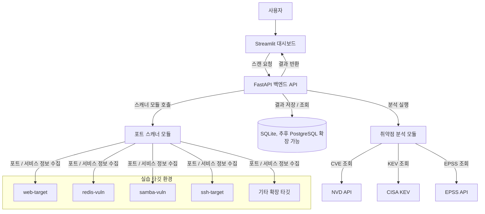

# Tribest ASM 스펙 문서

## 1. 프로젝트 개요

Tribest ASM은 내부 실습 환경을 대상으로 포트 스캔, 서비스 식별, 취약점 분석, 결과 조회 흐름을 확인하기 위한 프로젝트다.

지금 단계에서 구현된 범위는 다음과 같다.
- FastAPI 백엔드 스캐폴딩
- Streamlit 대시보드 스캐폴딩
- 취약점 분석 모듈 구현
- 스캐너 모듈 스캐폴딩
- Docker Compose 기반 실습 환경 구성
- mock 스캐너를 이용한 데모 실행 흐름

아직 완성형 플랫폼이라기보다는, 각 담당자가 자기 모듈을 이어서 개발할 수 있도록 공통 바닥을 만들어 둔 상태에 가깝다.

---

## 2. 아키텍처



---

## 3. 디렉터리 구조

```text
scanner/
analysis/
backend/
dashboard/
docker-compose.yml
PROJECT_SPEC.md
README.md
```

- `scanner/`
  - 스캐너 전용 모듈
  - 지금은 mock 구현이 들어 있고, 이후 실제 Nmap 기반 구현으로 교체할 예정
- `analysis/`
  - 취약점 분석 전용 모듈
  - 스캔 결과 JSON을 받아 분석 결과 JSON을 반환
- `backend/`
  - FastAPI 엔드포인트와 저장소 로직 담당
  - 스캐너와 분석 모듈을 호출하고 결과를 저장하거나 조회함
- `dashboard/`
  - Streamlit 기반 화면
  - 스캔 실행, 결과 확인, 타깃 현황 표시 담당
- `docker-compose.yml`
  - 실습용 서비스와 타깃 컨테이너 구성

---

## 4. Docker Compose 기준

현재 Compose에 포함된 서비스는 아래와 같다.

```text
docker-compose
 ├─ backend
 ├─ dashboard
 ├─ db
 ├─ web-target
 ├─ redis-vuln
 ├─ samba-vuln
 ├─ ssh-target
 └─ other-service
```

고정 IP는 다음과 같이 잡아두었다.
- `backend`: `172.28.0.2`
- `dashboard`: `172.28.0.3`
- `db`: `172.28.0.4`
- `web-target`: `172.28.0.10`
- `redis-vuln`: `172.28.0.20`
- `samba-vuln`: `172.28.0.30`
- `ssh-target`: `172.28.0.40`
- `other-service`: `172.28.0.50`

참고:
- 취약 컨테이너는 서로 다른 고정 IP를 쓰는 구조로 맞춰 두었다.
- `samba-vuln`, `ssh-target` 은 아직 placeholder 상태다.
- `mysql-target`, `elasticsearch-target`, `ftp-target` 은 아직 Compose에 추가하지 않았다.

---

## 5. 대시보드 기준

대시보드는 현재 아래 흐름으로 동작한다.

1. `스캔 콘솔` 탭에서 스캔 실행
2. 같은 화면 아래에서 결과 요약과 상세 결과 확인
3. 결과 영역에서 `스캔 결과` 와 `분석 결과` 를 나눠서 표시
4. 스캔 로그가 있으면 raw 로그까지 함께 표시
5. `타깃 목록` 탭에서 실행 가능한 타깃과 준비 중 타깃 확인
6. 사이드바에서 운영 정보와 추가 개발 가이드 확인

입력 방식은 두 가지다.
- `실습 타깃 선택`
- `직접 입력`

직접 입력은 현재 웹 타깃 기준으로 아래를 지원한다.
- 도메인 입력
- IP 입력

주의:
- 지금 보이는 타깃 목록은 사용자 설정형이 아니다.
- `dashboard/app.py` 안에 정의된 목록을 그대로 사용한다.
- UI에서 새 타깃을 추가하는 기능은 아직 없다.

---

## 6. 스캐너 기준

스캐너 모듈은 `scanner/` 폴더에 분리되어 있다.

현재 상태는 다음과 같다.
- 아직 실제 Nmap 실행은 하지 않음
- `scanner/scan.py` 가 진입점 역할을 함
- 현재는 `scanner/mock_scan.py` 를 통해 mock 결과를 반환함
- backend는 scanner 모듈을 호출만 하고, 스캐너 로직 자체는 들고 있지 않음

나중에 실제 스캐너가 맞춰야 할 핵심 계약은 아래와 같다.
- 입력: target
- 출력: 스캔 결과 JSON
- 서비스 정보는 `service.name`, `service.product`, `service.version` 으로 분리
- 가능하면 스캔 raw 로그도 함께 포함

### 분석 규칙 기준 서비스명 가이드

스캐너 담당자는 아래 서비스명을 우선 정확하게 맞추는 게 좋다.

- Redis
  - 권장 `service.name`: `redis`
  - 권장 `service.product`: `Redis`
  - 기본 포트: `6379`
- SSH
  - 권장 `service.name`: `ssh`
  - 권장 `service.product`: `OpenSSH`
  - 기본 포트: `22`
- Samba/SMB
  - 허용되는 이름: `samba`, `smb`, `microsoft-ds`, `netbios-ssn`
  - 권장 `service.product`: `Samba`
  - 기본 포트: `139`, `445`
- FTP
  - 권장 `service.name`: `ftp`
  - 권장 `service.product`: `vsftpd`, `proftpd`, `pure-ftpd` 중 실제 값
  - 기본 포트: `21`
- MySQL/MariaDB
  - 권장 `service.name`: `mysql`
  - 권장 `service.product`: `MySQL` 또는 `MariaDB`
  - 기본 포트: `3306`
- Elasticsearch
  - 권장 `service.name`: `elasticsearch`
  - 권장 `service.product`: `Elasticsearch`
  - 기본 포트: `9200`
- Web
  - 권장 `service.name`: `http`
  - 권장 `service.product`: `nginx` 또는 `Apache httpd`
  - 기본 포트: `80`, `443`

### 스캔 로그 계약

포트 스캐닝 로그를 같이 남기려면 `scan.logs` 필드를 사용한다.

권장 구조:

```json
{
  "scan": {
    "started_at": "2026-03-10T21:00:00+09:00",
    "ports": [],
    "logs": [
      {
        "source": "nmap",
        "phase": "service_detection",
        "command": "nmap -sV 172.28.0.20",
        "started_at": "2026-03-10T21:00:00+09:00",
        "finished_at": "2026-03-10T21:00:05+09:00",
        "return_code": 0,
        "stdout": "... raw output ...",
        "stderr": ""
      }
    ]
  }
}
```

이 구조를 쓰면 backend 저장과 dashboard 표시를 그대로 붙일 수 있다.

---

## 7. JSON 계약

### 7-1. 스캔 결과 JSON

```json
{
  "scan_id": "scan-001",
  "target": {
    "input_value": "redis.lab.local",
    "resolved_ip": "172.28.0.20"
  },
  "scan": {
    "started_at": "2026-03-10T21:00:00+09:00",
    "ports": [
      {
        "port": 22,
        "protocol": "tcp",
        "service": {
          "name": "ssh",
          "product": "OpenSSH",
          "version": "8.9p1"
        }
      },
      {
        "port": 6379,
        "protocol": "tcp",
        "service": {
          "name": "redis",
          "product": "Redis",
          "version": "4.0.14"
        }
      }
    ],
    "logs": [
      {
        "source": "nmap",
        "phase": "service_detection",
        "command": "nmap -sV redis.lab.local",
        "started_at": "2026-03-10T21:00:00+09:00",
        "finished_at": "2026-03-10T21:00:03+09:00",
        "return_code": 0,
        "stdout": "... raw output ...",
        "stderr": ""
      }
    ]
  }
}
```

### 7-2. 분석 결과 JSON

```json
{
  "scan_id": "scan-001",
  "analysis": {
    "vulnerabilities": [
      {
        "port": 6379,
        "service_name": "redis",
        "title": "Redis Unauthorized Access",
        "severity": "critical",
        "cve_id": null,
        "kev": false,
        "epss": null
      }
    ],
    "risk_summary": {
      "score": 82,
      "grade": "high"
    }
  },
  "drift": {
    "new_ports": [6379],
    "closed_ports": []
  }
}
```

이 구조는 스캐너, 분석기, 백엔드, 대시보드가 공통으로 맞춰야 하는 계약이다. 키 이름이나 중첩 구조를 임의로 바꾸면 연동이 바로 깨진다.

---

## 8. API 기준

현재 구현된 엔드포인트는 아래와 같다.
- `GET /health`
- `GET /api/v1/scans`
- `GET /api/v1/scans/{scan_id}`
- `GET /api/v1/analyses/{scan_id}`
- `POST /api/v1/scans/run`
- `POST /api/v1/analysis/run`
- `POST /api/v1/workflows/demo`
- `POST /api/v1/reports/{scan_id}`

메모:
- 지금은 `POST /api/v1/workflows/demo` 로 스캔과 분석을 한 번에 데모하는 흐름을 주로 쓴다.
- 리포트는 아직 export 기능이 아니라 stub 수준이다.

---

## 9. 분석 모듈 기준

분석 모듈은 이미 구현되어 있다.

포함된 내용:
- Pydantic 입력/출력 모델
- NVD 조회 + 오프라인 fallback
- KEV lookup 분리
- EPSS lookup 분리
- misconfiguration finding 지원
- rule-based risk 계산
- 이전 스캔 기반 drift 계산
- pytest 테스트

현재 지원하는 주요 rule-based finding 은 아래와 같다.
- `Redis Unauthorized Access`
- `SSH Service Exposure`
- `Samba Service Exposure`
- `FTP Plaintext Service Exposure`
- `Database Service Exposure`
- `Elasticsearch Unauthorized Access Risk`

현재 호출 형태는 아래와 같다.

```python
from analysis.analyzer import analyze

result = analyze(scan_result, previous_scan=None)
```

---

## 10. 다음 우선순위

1. `scanner/` 에 실제 Nmap 스캐너 연결
2. 사용자 설정형 타깃 목록 또는 DB 기반 타깃 관리 추가
3. `samba-vuln`, `ssh-target` 실제 서비스화
4. DB 기반 자동 drift 비교 강화
5. 리포트 export 구현
6. `mysql-target`, `elasticsearch-target`, `ftp-target` 확장

---

## 11. 역할별 작업 기준

### 스캐너 담당
- `scanner/` 안에서 작업
- 스캔 결과 JSON 계약 유지
- `service.name`, `service.product`, `service.version` 분리
- 포트 범위는 확장 가능하게 설계
- 위 서비스명 가이드를 우선 맞출 것
- 가능하면 `scan.logs` 도 함께 채울 것

### 분석 담당
- `analysis/` 안에서 작업
- 현재 JSON 계약 유지
- 외부 API 실패 시 graceful degradation 유지
- 공격 기능은 구현하지 않음

### 백엔드 담당
- `backend/` 안에서 작업
- scanner와 analysis를 연결하는 오케스트레이션에 집중
- 분석 로직이나 스캐너 로직을 backend 안에 중복 구현하지 않음

### 대시보드 담당
- `dashboard/` 안에서 작업
- 현재 구조를 유지하면서 시각화와 사용성 개선
- 계산 로직은 UI에 두지 않음

---

## 12. 정리

- 타깃 목록은 아직 사용자 설정형이 아니다.
- 스캐너는 현재 `scanner/` 안의 mock 구현을 사용한다.
- 분석 모듈은 실제로 동작한다.
- Compose는 고정 IP 기반 실습 환경으로 정리돼 있다.
- 포트 스캔 로그는 `scan.logs` 구조로 함께 저장하고 표시할 수 있다.
- 지금 단계의 목적은 팀이 각 모듈을 나눠서 개발할 수 있는 기반을 만드는 것이다.
